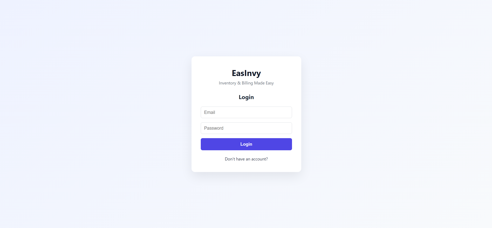
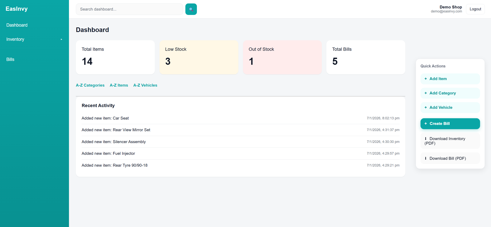
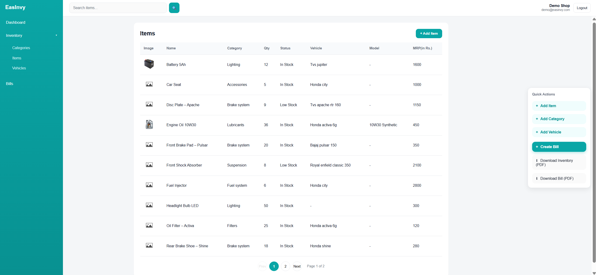

# EasInvy

**EasInvy** is a lightweight inventory and billing system built for small shops that need
a simple, fast, and reliable way to manage stock, vehicles, and sales — without complex software.

This project started as a real-world solution for auto-parts and repair shops that still
rely on notebooks or spreadsheets.

---

## 🚀 What EasInvy Does

EasInvy helps shop owners:

- Manage product categories and items
- Track stock quantity and low-stock alerts
- Organize inventory by vehicle type and model
- Create and manage bills
- Secure access with role-based authentication

The goal is **clarity and speed**, not bloated features.

---

## 🛠 Tech Stack

- **Frontend**: React + Vite
- **Backend**: Node.js + Express
- **Database**: MongoDB
- **Authentication**: JWT
- **Hosting**:
  - Frontend → Vercel
  - Backend → Railway

---

## 📸 Screenshots

---

## 👤 Demo Access

A demo account is available in **read-only mode** to explore the application.

🔗 Live Demo: https://www.easinvy.com/login
- email: demo@easinvy.com
- password: demo12345

> Write actions are restricted for demo users to protect data integrity.

---

## 🔐 Authentication & Security

- Secure password hashing
- JWT-based authentication
- Protected API routes
- Environment-based configuration

---

## 🎯 Why I Built This

Most small businesses don’t need complicated ERP systems.
They need something that:

- Works on any device
- Is easy to understand
- Can be customized quickly

EasInvy is built with that philosophy.

---

## 📦 Project Status

> ⚠️ This is an MVP under active development.

Features, UI, and architecture are continuously improving based on real usage feedback.

---

## 🤝 Freelance & Custom Work

I build **custom inventory, billing, and dashboard systems** like EasInvy.

If you need:
- A similar system for your business
- Custom features
- Deployment & setup
- Ongoing maintenance

📩 **Get in touch**  
Email: ridam6419r@gmail.com  
LinkedIn: www.linkedin.com/in/ridam-agrawal-928b61177

---

## 📄 License

This project is private and not intended for reuse without permission.

